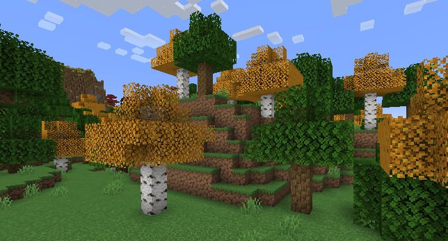
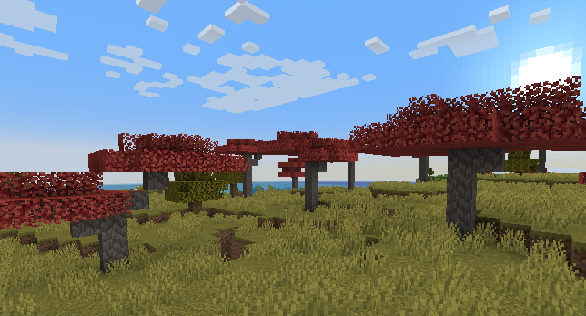

# Colorful Trees

## A Minecraft resource pack that tweaks trees.

Colorful Trees aims to bring a bit more variety to your Minecraft world without changing it too much. Two types of trees are concerned : birch and acacia, which leaves will respectively turn yellow and red. These changes will make birch forests more fun and more unique to explore, and will highlight the dryness of savannas, reinforcing their ambience. Another benefit of this pack? It will give an esthetic utility to these types of leaves!

## Additional info

This resource pack is compatible with Minecraft 1.19 (tested) and should work down to Minecraft 1.16 (not tested). Older versions - and more recent ones when there are - may not support Colorful Trees. If you're not familiar with Github, click on the "<> Code" button, then "Download ZIP" to download the pack. Any use of any resource from this pack is allowed as long as credit is given (e.g. link this Github repository in a text file).

## Preview

Some textures in these screenshots come from my other resource pack Lolito's Own. Please do not take them into consideration.

